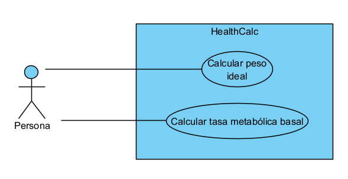

# isa2025-healthcalc
Health calculator used in Ingeniería del Software Avanzada

# HealthCalc

Este repositorio contiene una **calculadora de salud** con funciones para calcular el **peso ideal** y la **tasa metabólica basal (TMB)**.  

---

## Práctica 1: Casos de Prueba  

A continuación, se presentan los **casos de prueba** para validar el correcto funcionamiento de la calculadora de salud.  

### 🔹 **Cálculo del Peso Ideal (`idealBodyWeight(int height, char gender)`)**  
**Descripción:** Esta función calcula el **peso ideal** en base a la altura y género del usuario.  

| **Caso de Prueba** | **Entrada** | **Salida Esperada** |
|------------------|------------|------------------|
| 1. Persona masculina de 170 cm | `height = 170`, `gender = 'M'` | Peso ideal en kg según la fórmula usada. |
| 2. Persona femenina de 160 cm | `height = 160`, `gender = 'F'` | Peso ideal en kg según la fórmula usada. |
| 3. Altura fuera de rango | `height = -10`, `gender = 'M'` | Error: "Altura inválida". |
| 4. Género no reconocido | `height = 170`, `gender = 'X'` | Error: "Género inválido". |

---

### 🔹 **Cálculo de la Tasa Metabólica Basal (`basalMetabolicRate(float weight, int height, int age, char gender)`)**  
**Descripción:** Esta función calcula la **TMB**, que representa la cantidad de calorías que el cuerpo quema en reposo.  
| **Caso de Prueba** | **Entrada** | **Salida Esperada** |
|------------------|------------|------------------|
| 1. Hombre de 70 kg, 175 cm, 25 años | `weight = 70`, `height = 175`, `age = 25`, `gender = 'M'` | TMB calculada con la fórmula de Harris-Benedict. |
| 2. Mujer de 60 kg, 160 cm, 30 años | `weight = 60`, `height = 160`, `age = 30`, `gender = 'F'` | TMB calculada con la fórmula de Harris-Benedict. |
| 3. Peso inválido | `weight = -5`, `height = 160`, `age = 30`, `gender = 'F'` | Error: "Peso inválido". |
| 4. Edad fuera de rango | `weight = 60`, `height = 160`, `age = 200`, `gender = 'F'` | Error: "Edad fuera de rango". |
| 5. Género no reconocido | `weight = 70`, `height = 175`, `age = 25`, `gender = 'X'` | Error: "Género inválido". |

---

## Práctica 2: Diagrama de Caso de Uso  

A continuación, se muestra el diagrama de casos de uso de la calculadora de salud actualizado:  

### **CALCULAR TASA METABÓLICA BASAL (FULLY DRESSED VERSION)**  

- **Actor principal:** Persona (usuario).  
- **Ámbito:** Calculadora de salud.  
- **Nivel:** User goal.  

### 🎯 **Stakeholders e intereses:**  
- **Persona:** Quiere conocer su TMB para gestionar su alimentación y salud.  
- **Médico:** Puede usar la TMB para realizar diagnósticos o tratamientos preventivos.  
- **Entrenador deportivo:** Usa la TMB para crear planes de entrenamiento y alimentación.  

### ✅ **Precondición:**  
El usuario debe introducir datos válidos (peso, altura, edad y género).  

### ⚠️ **Garantía mínima:**  
El sistema notifica un error si los datos son inválidos.

### 🎯 **Garantía de éxito:**  
El sistema muestra la TMB calculada correctamente mediante la fórmula de Harris-Benedict.  

### 🔄 **Escenario principal:**  
1. El usuario accede a la función "Calcular tasa metabólica basal".  
2. El sistema solicita peso, altura, edad y género.  
3. El usuario introduce los datos.  
4. El sistema valida los datos.  
5. Se aplica la fórmula de Harris-Benedict.  
6. Se muestra la TMB calculada.  

### 🚨 **Escenarios alternativos:**  
  - **4a.** Datos inválidos (valores negativos, vacíos o fuera de rango).  
  - **4a.1** El sistema muestra un mensaje de error.  
  - **4a.2** Se solicita volver a ingresar los datos.  

### 🔀 **Extensiones:**  
- **2a.1** El sistema ofrece la opción de volver al menú principal.  
