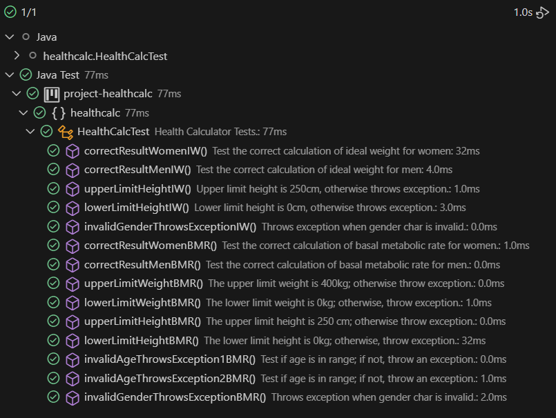
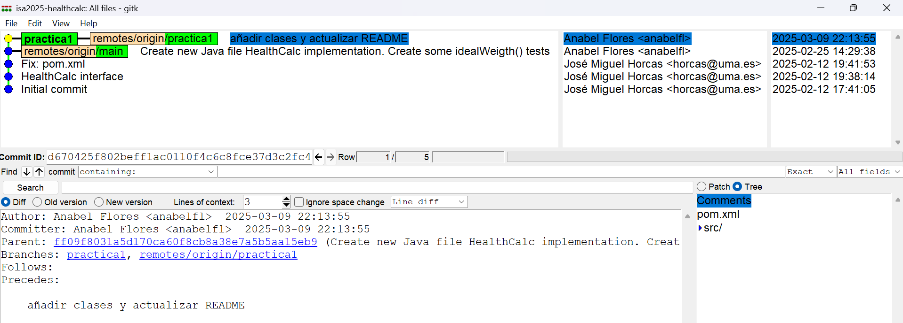
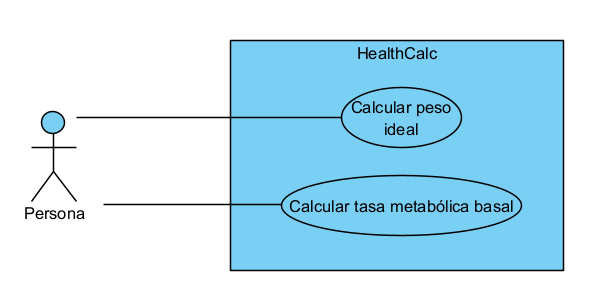
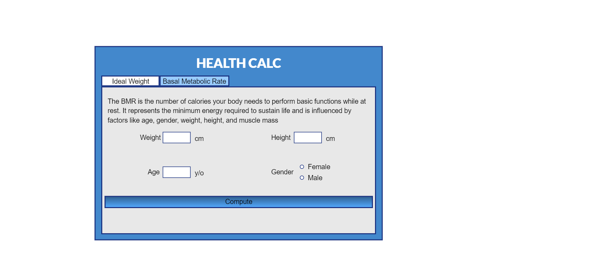
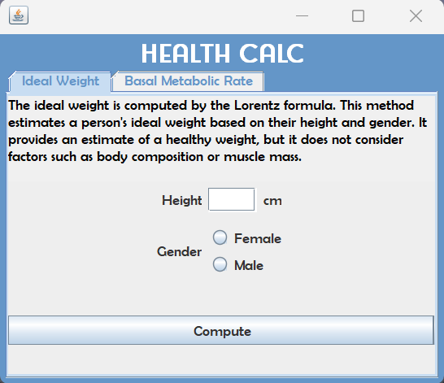
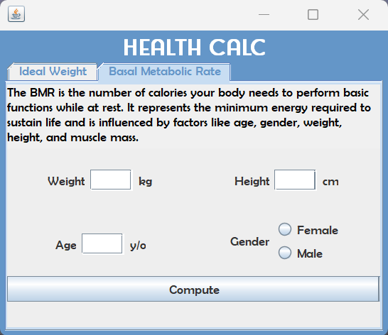
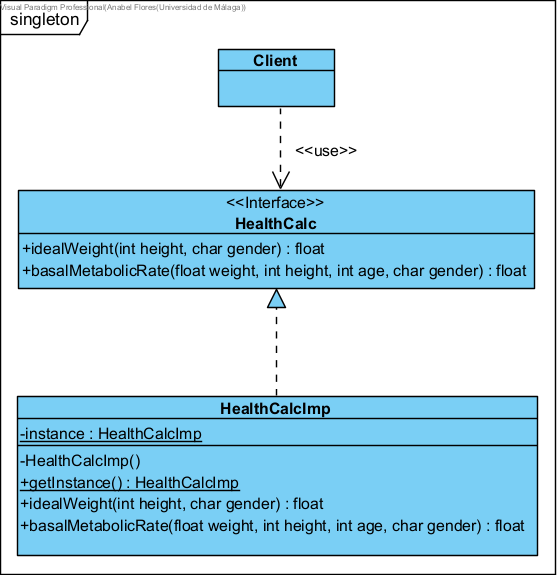
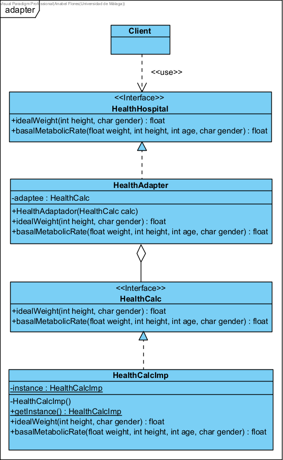
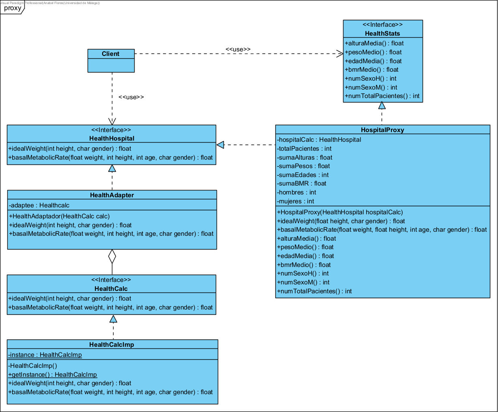
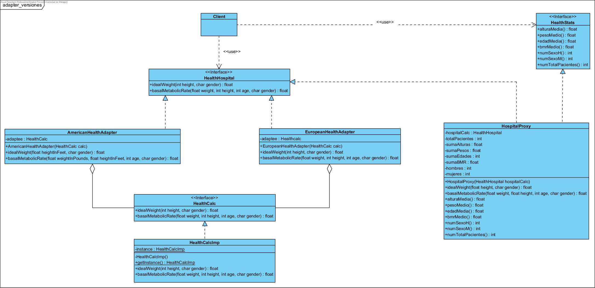

# isa2025-healthcalc
Health calculator used in Advanced Software Engineering

# HealthCalc

This repository contains a **health calculator** with functions to calculate **Ideal Weight (IW)** and **Basal Metabolic Rate (BMR)**.  

---

## Practice 1: Test Cases  

Below are the **test cases** to validate the correct operation of the health calculator.  

### 🔹 **Ideal Weight Calculation (`idealWeight(int height, char gender)`)**  
The Lorentz formula allows estimating the **ideal weight** approximately based on the user's height and gender:
- Male: `IW = height - 100 - (height - 150) / 4)`
- Female: `IW = height - 100 - (height - 150) / 2.5)`


| **Test Case** | **Input** | **Expected Output** |
|------------------|------------|------------------|
| 1. Calculate IW for a woman | `height = 164`, `gender = 'w'` | Ideal weight in kg according to Lorentz formula (58.4 kg). |
| 2. Calculate IW for a man | `height = 164`, `gender = 'm'` | Ideal weight in kg according to Lorentz formula (60.5 kg). |
| 3. Height greater than 250cm | `height = 250`, `gender = 'm'` | Error: "Height out of range". |
| 4. Height equal to 0cm  | `height = 0`, `gender = 'm'` | Error: "Height out of range". |
| 5. Invalid gender | `height = 169`, `gender = 'X'` | Error: "Invalid gender. Do use 'w' or 'm'". |

---

### 🔹 **Basal Metabolic Rate Calculation (`basalMetabolicRate(float weight, int height, int age, char gender)`)**  

The metabolic rate is the number of calories a person expends in a day.

The **Basal Metabolic Rate (BMR)** is this figure at rest, meaning without movement. It is the number of calories the body expends at rest to maintain vital functions such as breathing, heartbeats, and body temperature.
It helps to understand and calculate the total energy the body expends per day.

The key factors affecting the basal metabolic rate are gender, age, height, and weight.

To calculate this value, the Harris-Benedict formula is used:
- Male: `BMR = 88.362 + 13.397 * weight + 4.799 * height - 5.677 * age`
- Female: `BMR = 447.593 + 9.247 * weight + 3.098 * height - 4.330 * age`


| **Test Case** | **Input** | **Expected Output** |
|------------------|------------|------------------|
| 1. Calculate BMR for a woman | `weight = 65`, `height = 164`, `age = 21`, `gender = 'w'` | BMR according to the Harris-Benedict formula (1465.79 kcal/day). |
| 2. Calculate BMR for a man | `weight = 70`, `height = 177`, `age = 23`, `gender = 'm'` | BMR according to the Harris-Benedict formula (1745.004 kcal). |
| 3. Invalid weight | `weight = 460`, `height = 200`, `age = 45`, `gender = 'm'` | Error: "Weight out of range (1-400 kg)". |
| 4. Invalid weight | `weight = 0`, `height = 120`, `age = 10`, `gender = 'w'` | Error: "Weight out of range (1-400 kg)". |
| 5. Invalid height | `weight = 60`, `height = 260`, `age = 65`, `gender = 'm'` | Error: "Height out of range (1-250 cm)". |
| 6. Invalid height | `weight = 60`, `height = -4`, `age = 10`, `gender = 'w'` | Error: "Height out of range (1-250 cm)". |
| 7. Age out of range | `weight = 60`, `height = 100`, `age = -3`, `gender = 'm'` | Error: "Age out of range (1-110 years)". |
| 8. Age out of range | `weight = 60`, `height = 100`, `age = 130`, `gender = 'm'` | Error: "Age out of range (1-110 years)". |
| 9. Unrecognized gender | `weight = 60`, `height = 150`, `age = 23`, `gender = 'p'` | Error: "Invalid gender. Do use 'w' or 'm'". |

---

### 🔹 Running Test Cases Using Maven

Verification that the tests have been successfully executed:



### 🔹 Snapshot Log

Capture showing the commits made during the practice.



### 🔹 External Links   

For the creation of this README file and program code implementation, artificial intelligence assistance and external pages such as https://www.tuasaude.com/es/tasa-metabolica-basal/ were used.

---

## Practice 2: Use Case Diagram  

The updated use case diagram of the health calculator is shown below:  



### **CALCULATE BASAL METABOLIC RATE (FULLY DRESSED VERSION)**  

- **Primary Actor:** Person (user).  
- **Scope:** Health calculator.  
- **Level:** User goal.  

### 🎯 **Stakeholders and Interests:**  
- **Person:** Wants to know their BMR to manage their diet and health.  
- **Doctor:** Can use BMR for diagnostics or preventive treatments.  
- **Sports Trainer:** Uses BMR to create training and nutrition plans.  

### ✅ **Precondition:**  
The user must enter valid data (weight, height, age, and gender).  

### ⚠️ **Minimal Guarantee:**  
The system notifies an error if the data is invalid.

### 🎯 **Success Guarantee:**  
The system correctly displays the calculated BMR using the Harris-Benedict formula.  

### 🔄 **Main Scenario:**  
1. The user accesses the "Calculate Basal Metabolic Rate" function.  
2. The system requests weight, height, age, and gender.  
3. The user enters the data.  
4. The system validates the data.  
5. The Harris-Benedict formula is applied.  
6. The calculated BMR is displayed.  

### 🚨 **Alternative Scenarios:**  
  - **4a.** Invalid data (negative values, empty, or out of range).  
  - **4a.1** The system displays an error message.  
  - **4a.2** The system requests re-entering the data.  

### 🔀 **Extensions:**  
- **2a.1** The system offers the option to return to the main menu.  

---

## Practice 3: User Stories

The user stories and acceptance criteria scenarios for the health calculator are defined as it follows. The tests have been implemented using the Behaviour-Driven Development (BDD) methodology using Gherkin and Cucumber.

### User Story 1️⃣: Compute Ideal Weight

**As a person, I want to know the ideal weight**
- Given physical characteristics
- So that I can determine the target weight for a healthy lifestyle.

#### Scenarios:

**Scenario 1: Computing the correct value for ideal weight for women**
```
Given a health calculator
And height is 164 cm
And gender is female
When I compute the ideal weight function
Then the system returns a value between 58.3 and 58.5 kg.
```

**Scenario 2: Computing the correct value for ideal weight for men**
```
Given a health calculator
And height is 180 cm
And gender is male
When I compute the ideal weight function
Then the system returns a value between 72.4 and 72.6 kg.
```

**Scenario 3: Invalid height inputs**
```
Given a health calculator
And height is <h> cm
And gender is female
When I compute the ideal weight function
Then the system throws an exception with the message "Height out of range (1-250)".
```

**Examples:**

|  h  |
|-----|
| -10 |
|  0  |
| 260 |

**Scenario 4: Invalid gender input**
```
Given a health calculator
And height is 170 cm
And gender is x
When I compute the ideal weight function
Then the system throws an exception with the message "Invalid gender. Do use 'w' or 'm'".
```

### User Story 2️⃣: Compute Basal Metabolic Rate 

**As a person, I want to know the basal metabolic rate**
- Given physical characteristics
- So that I can improve my lifestyle.

#### Scenarios:

**Scenario 1: Computing the correct value for basal metabolic rate for women**
```
Given a health calculator
And weight is 64 kg
And height is 164 cm
And age is 21 years
And gender is female
When I compute the basal metabolic rate function
Then the system returns a value between 1456.4 and 1456.6.
```

**Scenario 2: Computing the correct value for basal metabolic rate for men**
```
Given a health calculator
And weight is 80 kg
And height is 184 cm
And age is 25 years
And gender is male
When I compute the basal metabolic rate function
Then the system returns a value between 1901.1 and 1901.3.
```

**Scenario 3: Invalid weight input. Upper limit exceeded**
```
Given a health calculator
And weight is 450 kg
And height is 184 cm
And age is 25 years
And gender is male
When I compute the basal metabolic rate function
Then the system throws an exception with the message "Weight out of range (1-400 kg)".
```

**Scenario 4: Invalid weight input. Lower limit exceeded**
```
Given a health calculator
And weight is -89 kg
And height is 184 cm
And age is 25 years
And gender is male
When I compute the basal metabolic rate function
Then the system throws an exception with the message "Weight out of range (1-400 kg)".
```

**Scenario 6: Invalid height inputs**
```
Given a health calculator
And weight is 65 kg
And height is <h> cm
And age is 23 years
And gender is female
When I compute the basal metabolic rate function
Then the system throws an exception with the message "Height out of range (1-250 cm)".
```

**Examples:**

|  h  |
|-----|
| -10 |
|  0  |
| 260 |

**Scenario 7: Invalid age input. Upper limit exceeded**
```
Given a health calculator
And weight is 54 kg
And height is 156 cm
And age is 120 years
And gender is female
When I compute the basal metabolic rate function
Then the system throws an exception with the message "Age out of range (1-110 years)".
```

**Scenario 8: Invalid age input. Lower limit exceeded**
```
Given a health calculator
And weight is 54 kg
And height is 156 cm
And age is 0 years
And gender is female
When I compute the basal metabolic rate function
Then the system throws an exception with the message "Age out of range (1-110 years)".
```

**Scenario 9: Invalid gender input**
```
Given a health calculator
And weight is 54 kg
And height is 156 cm
And age is 12 years
And gender is x
When I compute the basal metabolic rate function
Then the system throws an exception with the message "Invalid gender. Do use 'w' or 'm'".
```
---

## Practice 4: Graphical User Interface

### 🔹 Mockup




### 🔹 HealthCalc Application

Captures showing the Ideal Weight and Basal Metabolic Rate GUI from the application.





---

## Practice 6: Design Patterns

### Singleton Pattern
The **Singleton Pattern** is used in the `HealthCalculator` class to ensure that only one instance of the calculator exists throughout the application.



The Singleton is implemented with a static `getInstance()` method that returns the unique instance of the `HealthCalculator`.


### Adapter Pattern

The **Adapter Pattern** is applied because we need to adapt the existing `HealthCalculator` interface to match the new `HealthHospital` interface required by the hospital. By using this pattern, we can integrate the calculator without changing its core logic. The adapter acts as a bridge between the two interfaces, ensuring that the existing calculator functionality is reused while making it compatible with the hospital system.




### Proxy Pattern

To fulfill the requirement of tracking calculator usage and computing statistical averages of patient data while preserving the anonymity of users, we applied the **Proxy Design Pattern**.
This pattern allows us to extend the functionality of the original health calculator without modifying its implementation. 




### Adapter Pattern

To support both European (meters and grams) and American (feet and pounds) input formats while reusing the existing calculator (which works with centimeters and kilograms), we applied the **Adapter Design Pattern**.

The adapter classes convert input units to the expected format and delegate calculations to the original calculator. This ensures compatibility without modifying the core logic. Additionally, the adapters handle localized BMR messages in both English and Spanish.




